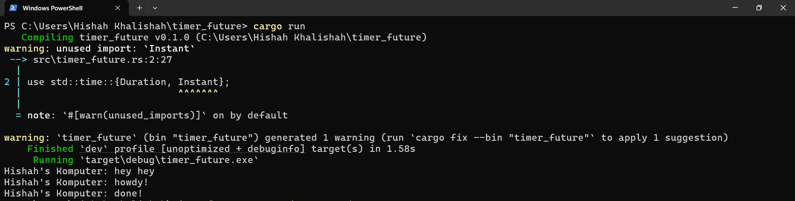

## Experiment 1.2: Understanding how it works

### Output

### Explanation
The output shows that "hey hey" is printed immediately after the task is spawned,
even before the async block runs.

This happens because `spawner.spawn(...)` only schedules the task — it doesn't block.
The executor (`executor.run()`) is the one that polls and runs the async task.
Therefore, the line after `spawn` (i.e., `println!("hey hey")`) runs first.

This confirms how the executor operates: tasks are scheduled, not immediately executed.

## Experiment 1.3: Multiple Spawn and removing drop

### Screenshot without drop(spawner)

### Screenshot with drop(spawner)

### Explanation

- **Spawner** is responsible for sending tasks (futures) to the executor.
- **Executor** continuously pulls tasks from the channel and polls them to completion.
- If `drop(spawner)` is **not called**, the executor assumes **there may still be more tasks coming**, so it **waits forever** and may appear stuck.
- When `drop(spawner)` is called, the channel is closed — so `executor.run()` returns **only when all queued tasks are completed**, and no more tasks are expected.

This shows the importance of cleaning up the spawner after use to signal task submission is done.
